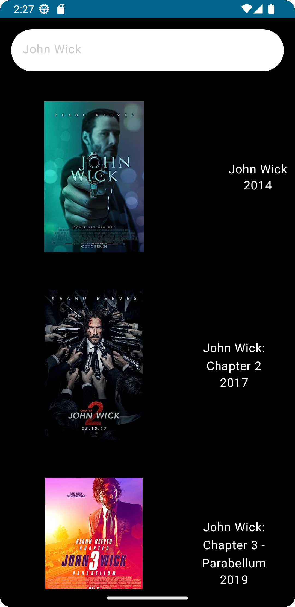
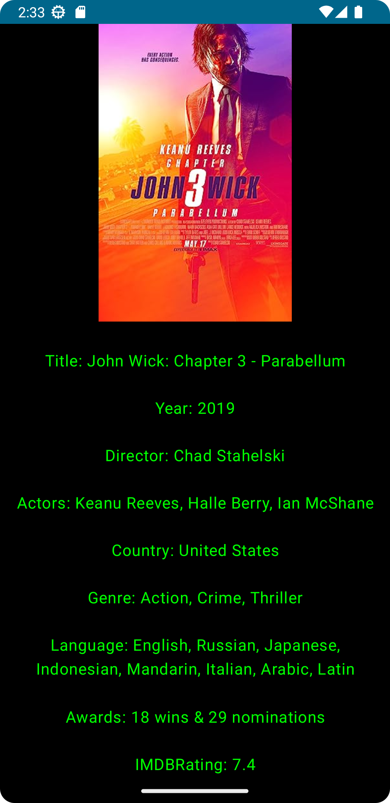

<!-- Improved compatibility of back to top link: See: https://github.com/othneildrew/Best-README-Template/pull/73 -->

<!--
*** Thanks for checking out the Best-README-Template. If you have a suggestion
*** that would make this better, please fork the repo and create a pull request
*** or simply open an issue with the tag "enhancement".
*** Don't forget to give the project a star!
*** Thanks again! Now go create something AMAZING! :D
-->

<!-- PROJECT SHIELDS -->
<!--
*** I'm using markdown "reference style" links for readability.
*** Reference links are enclosed in brackets [ ] instead of parentheses ( ).
*** See the bottom of this document for the declaration of the reference variables
*** for contributors-url, forks-url, etc. This is an optional, concise syntax you may use.
*** https://www.markdownguide.org/basic-syntax/#reference-style-links
-->

### My LinkedIn Profile -> [![LinkedIn][linkedin-shield]][linkedin-url]

<!---->

[linkedin-shield]: https://img.shields.io/badge/LinkedIn-0077B5?style=for-the-badge&logo=linkedin&logoColor=white
[linkedin-url]: https://www.linkedin.com/in/%C3%B6mer-faruk-bing%C3%B6l-33a47a187/

<!-- PROJECT LOGO -->
 

  

<h3 align="center">Movie App</h3>

  

    Clean Architecture Compose Movie App
     
    <a href="https://github.com/wolfscatt/CleanArchitectureMovieApp"><strong>Explore the docs »</strong></a>
     
     
  

<!-- TABLE OF CONTENTS -->

  
Table of Contents

  <ol>
    <li>
      <a href="#about-the-project">About The Project</a>
      <ul>
        <li><a href="#built-with">Built With</a></li>
      </ul>
    </li>
  </ol>

<!-- ABOUT THE PROJECT -->
## About The Project

<!---->

  

      <td></td>
      <td></td>
  

### There are 2 in-app screenshots. Simple app, data comes from api and looks like in first picture. The second picture shows the details of the movie you clicked on.

(<a href="#readme-top">back to top</a>)

### Built With

* [![Kotlin][Kotlin.org]][Kotlin-url]
* [![Android][Android]][Android-url]

(<a href="#readme-top">back to top</a>)

[Kotlin.org]: https://img.shields.io/badge/Kotlin-0095D5?&style=for-the-badge&logo=kotlin&logoColor=white
[Kotlin-url]: https://kotlinlang.org/
[Android]: https://img.shields.io/badge/Android_Studio-3DDC84?style=for-the-badge&logo=android-studio&logoColor=white
[Android-url]: https://developer.android.com/studio

